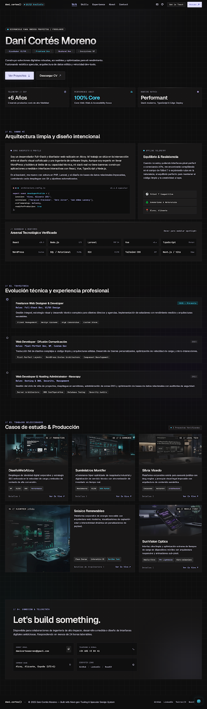

# Dani Cortés Moreno — Portfolio Web

> **Full-Stack Developer & UI/UX Designer**  
> Soluciones digitales robustas, accesibles y de alto rendimiento con estética *Obsidian Precision*.



---

## ⚡ Tecnologías y Stack

* **Frontend:** [React 18](https://react.dev/) + [TypeScript](https://www.typescriptlang.org/) (Strict Mode)
* **Build Tool:** [Vite 6](https://vitejs.dev/) (HMR sub-300ms, empaquetado optimizado con Rollup)
* **Sistema de Diseño:** Vanilla CSS Modular con tokens de diseño CSS Custom Properties
* **Iconografía:** [Lucide React](https://lucide.dev/) + [Google Material Symbols](https://fonts.google.com/icons)
* **Tipografías:** Geist (display), Inter (cuerpo de lectura), JetBrains Mono (código y telemetría)
* **Micro-interacciones:** Dynamic Radial Cursor Spotlight Tracking, Canvas Confetti

---

## ✨ Características Principales

* 🎯 **Diseño Obsidian Precision:** Estética oscura técnica inspirada en herramientas como Linear, Raycast y Vercel con bordes hairlines de 1px a 8% de opacidad y acentos Electric Indigo y Cyan.
* ⌨️ **Command Palette (`⌘K` / `Ctrl+K`):** Buscador flotante para navegar por el portfolio, saltar a secciones, ver proyectos o copiar canales de contacto sin usar el ratón.
* 💻 **Dev CLI Terminal Simulator:** Terminal interactiva integrada con soporte para comandos como `help`, `neofetch`, `projects`, `skills`, `contact` y `clear`, con memoria de historial (`↑` / `↓`).
* 📦 **Casos de Estudio Detallados:** Modal interactivo por cada proyecto con desglose de desafío, solución técnica, arquitectura de software y métricas verificadas de producción (Core Web Vitals 99+, tiempos sub-segundo, conversiones).
* 🍱 **Bento Grid Asimétrico:** Maquetación modular para el perfil, valores centrales, configuración TypeScript interactiva y telemetría offline.
* 📨 **Canales de Contacto Directo:** Copia de correo electrónico en un clic con animación de confeti y formulario reactivo para cotización de proyectos.
* 💬 **Widget WhatsApp Elástico:** Botón flotante expandible al hover con indicador de pulso en vivo para comunicación rápida.

---

## 📁 Estructura del Proyecto

```bash
Portfolio/
├── public/                      # Activos estáticos públicos
├── src/
│   ├── components/              # Componentes de UI modulares
│   │   ├── About.tsx            # Bento sobre mí y simulador de código
│   │   ├── CommandPalette.tsx   # Paleta de comandos (⌘K)
│   │   ├── Contact.tsx          # Formulario y canales de contacto
│   │   ├── Experience.tsx       # Trayectoria con timeline técnico y LEDs
│   │   ├── Footer.tsx           # Pie de página y créditos
│   │   ├── Hero.tsx             # Sección inicial de alto impacto
│   │   ├── Navbar.tsx           # Navegación fija con efecto cristal
│   │   ├── ProjectModal.tsx     # Modal de caso de estudio
│   │   ├── Projects.tsx         # Grid bento de proyectos
│   │   ├── Skills.tsx           # Arsenal técnico con filtros
│   │   ├── TerminalModal.tsx    # Terminal interactiva CLI
│   │   └── WhatsAppWidget.tsx   # Botón flotante de WhatsApp
│   ├── data/                    # Capa de datos desacoplada
│   │   ├── experience.ts        # Historial profesional
│   │   ├── profile.ts           # Información biográfica y telemetría
│   │   ├── projects.ts          # Casos de estudio y métricas
│   │   └── skills.ts            # Tecnologías verificadas
│   ├── hooks/
│   │   └── useSpotlight.ts      # Seguimiento dinámico de cursor
│   ├── styles/
│   │   ├── components.css       # Estilos de componentes y utilidades
│   │   ├── global.css           # Resets y fondos técnicos
│   │   └── tokens.css           # Variables de diseño (Obsidian Precision)
│   ├── App.tsx                  # Componente raíz
│   └── main.tsx                 # Montaje en el DOM
├── index.html                   # HTML base y configuración SEO/OpenGraph
├── package.json                 # Dependencias y scripts
├── tsconfig.json                # Configuración del compilador TypeScript
└── vite.config.ts               # Configuración de Vite
```

---

## 🚀 Inicio Rápido en Local

1. **Instalar dependencias:**
   ```bash
   npm install
   ```

2. **Iniciar servidor de desarrollo:**
   ```bash
   npm run dev
   ```
   La aplicación estará disponible en `http://localhost:3000/`.

3. **Compilar para producción:**
   ```bash
   npm run build
   ```

4. **Previsualizar compilación de producción:**
   ```bash
   npm run preview
   ```

---

## 🌐 Despliegue en Producción

El proyecto está preparado para desplegarse fácilmente en plataformas modernas de hosting estático / edge:

### Vercel / Netlify / Cloudflare Pages / Hostinger:
* **Build Command:** `npm run build`
* **Output Directory:** `dist`
* **Node Version:** 18+ (Recomendado 20+)

---

## 📬 Contacto

* **Autor:** Dani Cortés Moreno
* **Email:** [danicortesmoreno@gmail.com](mailto:danicortesmoreno@gmail.com)
* **Teléfono:** [+34 601 43 84 41](tel:+34601438441)
* **Ubicación:** Alcoy, Alicante, España
* **GitHub:** [github.com/DaniCortesMoreno](https://github.com/DaniCortesMoreno)
